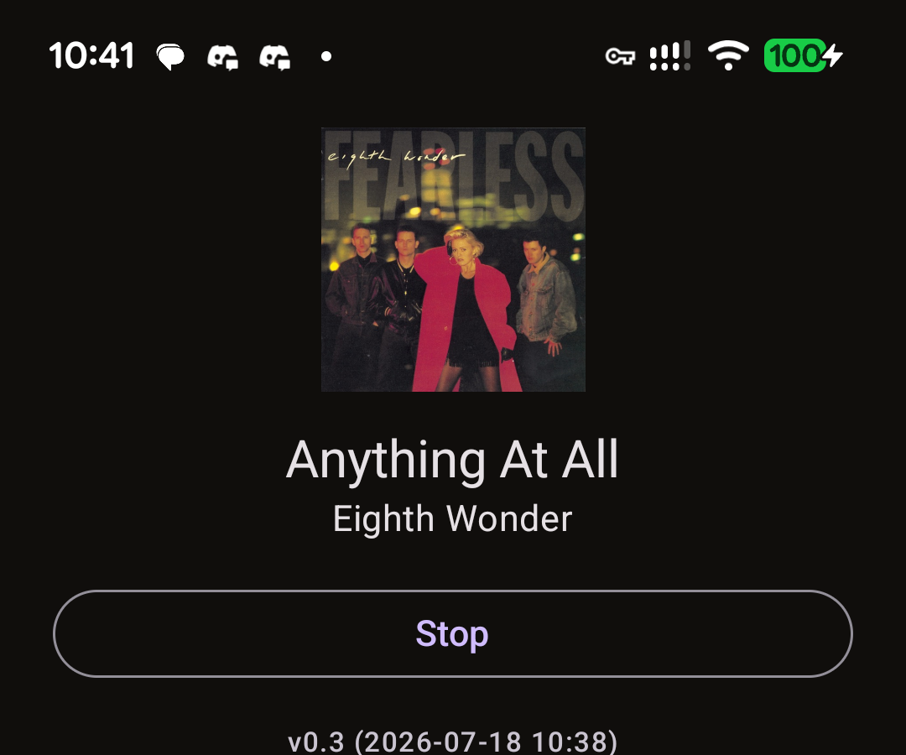

# Subwave Auto

Player to connect to Subwave using Android Auto.

Android app that streams a single Icecast station, shows the current artist
artwork/track/release year, and supports Android Auto.

## Features

- Enter a server address; the app normalizes it to
  `http(s)://host:7700/stream.mp3` (adds port `7700` and the `/stream.mp3`
  path automatically if missing).
- Parses ICY metadata from the stream to get "Artist - Track".
- Looks up cover art and release year via the iTunes Search API.
- Falls back to a static app icon when artwork can't be found.
- Persists the last **successfully connected** server address; a failed
  connection is never saved.
- Shows a readable error message (toast) when a connection fails.
- Android Auto support via Media3 `MediaLibraryService` — single stream,
  no browse menu needed.

## Screenshots



## Structure

```
app/src/main/java/com/subwave/radio/
  player/   ExoPlayer + MediaLibraryService + URL normalization + error mapping
  data/     SharedPreferences persistence, iTunes metadata lookup
  ui/       Compose screens (PlayerViewModel, PlayerScreen)
```

## Requirements

- Android Studio (Ladybug or newer)
- minSdk 24, targetSdk 35
- Kotlin 2.0+

## Setup

1. Open in Android Studio, let Gradle sync.
2. Run on a device/emulator, or launch the **Android Auto Desktop Head Unit**
   from Android Studio's SDK tools to test the car UI.
